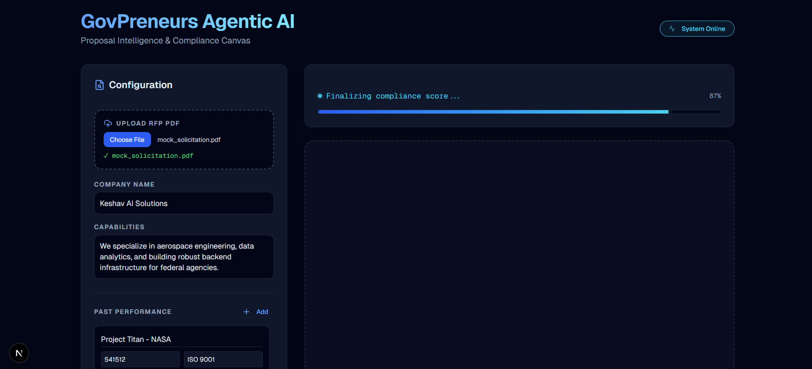
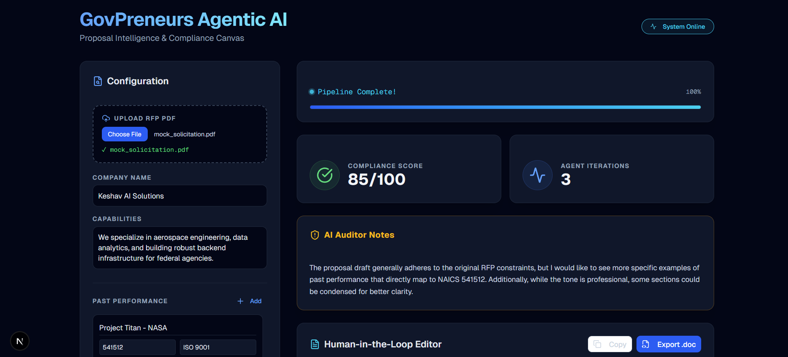
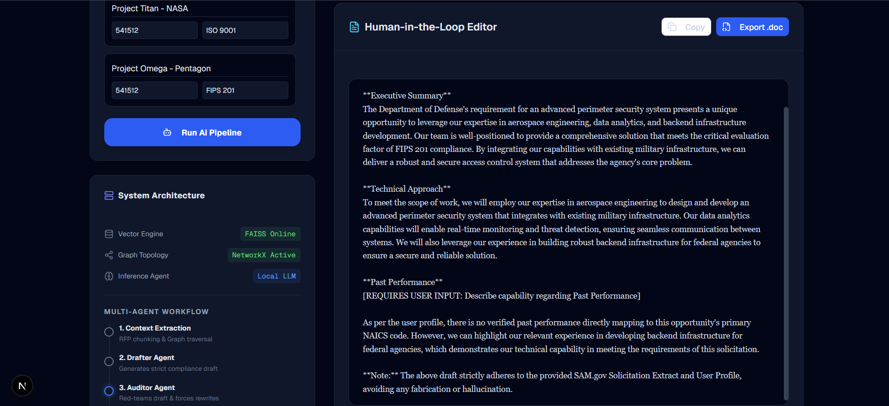

<div align="center">

# 🏛️ GovPreneurs Agentic AI
**Autonomous, Air-Gapped Federal Proposal Generation Pipeline**

[](https://fastapi.tiangolo.com/)
[](https://nextjs.org/)
[](https://python.langchain.com/docs/langgraph)
[](https://ollama.com/)
[](https://opensource.org/licenses/MIT)

<br/>

> **GovPreneurs Agentic AI** is an enterprise-grade, Multi-Agent hybrid-RAG application designed to autonomously draft, audit, and finalize highly compliant government contracting proposals (RFPs).

### 📸 Platform Interface & System in Action

<div align="center">

  <b>Dashboard & Configuration Canvas</b><br><br>
  <a href="docs/dashboard.png">
    
  </a>
  <br><br><br>

  <table align="center" width="100%">
    <tr>
      <td align="center" width="50%">
        <b>⚡ Agentic Pipeline Tracking</b><br><br>
        <a href="docs/processing.png">
          
        </a>
      </td>
      <td align="center" width="50%">
        <b>📝 Human-in-the-Loop Canvas</b><br><br>
        <a href="docs/editor.png">
          
        </a>
      </td>
    </tr>
  </table>

</div>

## ⚡ Executive Summary

Writing federal proposals is historically slow, manual, and prone to compliance failures. Relying on standard AI chat interfaces introduces severe risks of hallucination and non-compliance. 

**GovPreneurs Agentic AI** solves this through a deterministic **"Maker/Checker" architecture**. By leveraging a localized LangGraph multi-agent system, the platform grounds its drafting in a dual-retrieval system (FAISS Vector Database + NetworkX Knowledge Graph) and forces an AI Auditor to red-team the output before a human ever sees it. 

### 🚀 Key Innovations
- **Hybrid RAG Context Engine:** Combines FAISS (Vector search for RFP constraints) with NetworkX (Graph topology for entity resolution of past performance).
- **Adversarial Agent Loop:** A LangGraph state machine where a `DrafterAgent` writes the proposal, and an `EvaluatorAgent` audits it against strict NAICS/FIPS standards. If the draft fails, it is sent back for a rewrite.
- **Human-in-the-Loop (HITL) Canvas:** A live UI editor that allows human experts to finalize the AI's compliant draft before 1-click exporting to Microsoft Word.
- **Data Engineering (ETL):** Custom scrapers and normalizers designed to pull and clean data directly from SAM.gov.
- **100% Air-Gapped Privacy:** Powered by local Ollama LLMs (`llama3`), ensuring sensitive proprietary company data never leaves the local machine.

---

## 🧠 System Architecture

### 1. The Data Ingestion & ETL Layer
Government data is notoriously messy. The `etl/` pipeline cleans and normalizes SAM.gov data. When a user uploads a government RFP PDF, the backend processes the document. Text is chunked, embedded, and stored in a transient **FAISS Vector Store**. Simultaneously, the user's company profile and past performance metrics are mapped into a **Dynamic Knowledge Graph**, preventing the AI from hallucinating unverified project history.

### 2. The LangGraph State Machine
The core engine operates on a cyclic directed graph:
1. **Node 1 (`draft_proposal`):** The Generator agent reads the Graph facts and Vector constraints, generating a highly rigid, factual proposal draft.
2. **Node 2 (`evaluate_proposal`):** The Evaluator agent acts as a Federal Auditor. It scores the draft out of 100, checking for hallucinated metrics and missing constraints.
3. **Conditional Edge:** If the score is `< 90` or iterations hit the limit, the Auditor injects feedback into the state, routing back to Node 1 for an automatic rewrite. If `>= 90`, it routes to the frontend.

---

## 🛠️ Tech Stack

### Frontend Architecture
* **Framework:** Next.js 14 (App Router)
* **Styling:** Tailwind CSS + Glassmorphism UI Elements
* **Components:** shadcn/ui & Lucide Icons
* **Features:** Live agent-state terminal, dynamic progress visualization, `.doc` export compiler.

### Backend Intelligence
* **API:** FastAPI (Python)
* **Agent Orchestration:** LangGraph (StateGraph)
* **Local Inference:** Ollama Python Client (`llama3`)
* **Vector Engine:** FAISS (Facebook AI Similarity Search)
* **Graph Topology:** NetworkX
* **Data Pipeline:** Custom ETL scripts (`sam_scraper.py`, `normalizer.py`)

---

## 📂 Project Structure

```text
govpreneurs-auto-proposal/
├── backend/
│   ├── app/
│   │   ├── api/
│   │   │   └── routes.py         # FastAPI endpoints & File Upload handler
│   │   └── main.py               # Uvicorn Server Entry Point
│   ├── data/                     # Transient storage for RFPs (e.g., mock_solicitation.pdf)
│   ├── docs/                     # System prompts, schemas, and architecture strategy
│   │   ├── 1_data_schema.json
│   │   ├── 2_ingestion_strategy.md
│   │   ├── 3_rag_pipeline.md
│   │   ├── 4_system_prompt.txt
│   │   └── 5_knowledge_graph_strategy.md
│   ├── etl/                      # Data engineering pipeline
│   │   ├── normalizer.py         # Data cleaning logic
│   │   └── sam_scraper.py        # Automated SAM.gov data extraction
│   ├── rag/
│   │   ├── agent.py              # LangGraph State Machine orchestrator
│   │   ├── document_loader.py    # FAISS Vectorization & chunking
│   │   ├── evaluator.py          # Auditor Agent (Compliance Red-Teaming)
│   │   ├── generator.py          # Drafter Agent (LLM Generation)
│   │   └── knowledge_graph.py    # NetworkX Entity Resolution
│   ├── create_mock_pdf.py        # Utility to generate test solicitations
│   ├── requirements.txt          # Python dependencies
│   └── test_pipeline.py          # End-to-end backend test script
├── frontend/
│   ├── app/
│   │   ├── globals.css           # Custom Tailwind directives
│   │   ├── layout.tsx
│   │   └── page.tsx              # Main Dashboard & HITL UI
│   ├── components/               # Reusable UI components (shadcn)
│   ├── lib/                      # Utility functions
│   ├── public/                   # Static assets
│   ├── package.json              # Node dependencies
│   └── README.md                 # Frontend specific readme
└── README.md                     # Master Project Documentation
```
## 💻 Local Deployment Guide
To run this application locally, you will need two separate terminal windows. Ensure you have Node.js, Python 3.11+, and Ollama installed.

### Step 1: Start the Local AI Engine
Ensure Ollama is running in the background and you have pulled the necessary model:
```
Bash
ollama serve
ollama run llama3
```

### Step 2: Boot the FastAPI Backend
Open Terminal 1, navigate to the backend, install requirements, and start the server:
```
Bash
cd backend
pip install -r requirements.txt
uvicorn app.main:app --reload
The backend will be live at http://127.0.0.1:8000
```

### Step 3: Boot the Next.js Frontend
Open Terminal 2, navigate to the frontend, install dependencies, and start the UI:
```
Bash
cd frontend
npm install
npm run dev
The application will be live at http://localhost:3000
```

## 🎯 The Agentic Workflow

| Phase | Action | Under the Hood |
| :--- | :--- | :--- |
| **1. 📄 Ingestion** | **Configure** | Upload a live government RFP (`.pdf`) into the secure local dashboard. |
| **2. 🏢 Entity Mapping** | **Profile Setup** | Inject your company capabilities, NAICS codes, and past performance. |
| **3. ⚡ Ignition** | **Run Pipeline** | Watch the live terminal as FAISS chunks text and NetworkX builds the graph. |
| **4. 🔄 Adversarial Audit** | **The Loop** | Observe the Drafter and Evaluator argue and rewrite until hitting 90%+ compliance. |
| **5. 🧑‍💻 HITL Canvas** | **Finalize & Export** | Review Auditor notes, tweak the text in the live editor, and 1-click export to `.doc`. |

<br/>

---

<div align="center">

### 👨‍💻 System Architect

**Engineered with ⚡ by Keshav**

*B.Tech CSE (Data Analytics) @ VIT-AP University* <br>
*President of SEDS Aurora | NASA Space Apps Global Winner*

**Focus Areas:** Multi-Agent Systems • RAG & Knowledge Graphs • NLP <br>
**Notable Architecture:** *GovPreneurs Auto-Proposal, SeismoSearch, Swar Smriti, TruthLayer*

[](https://github.com/your-github-username)
[](https://linkedin.com/in/your-linkedin-username)

</div>
